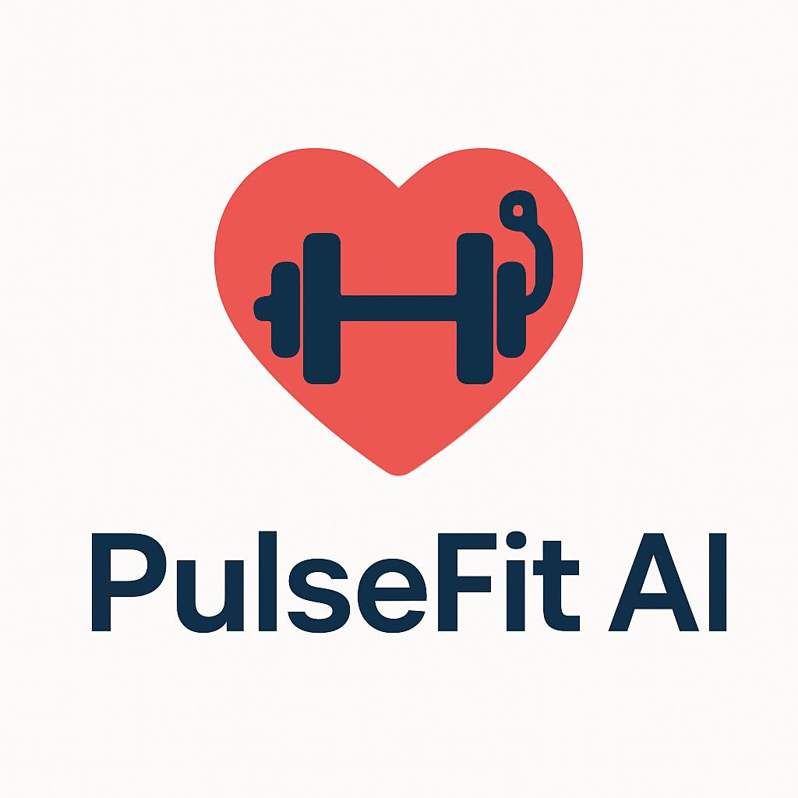

<!DOCTYPE html>
<html lang="en">
<head>
  <meta charset="UTF-8" />
  <meta name="viewport" content="width=device-width, initial-scale=1.0" />
  <title>PulseFit AI - Smart Gym Health Monitoring</title>
  
</head>
<body>

  <header>
    
    <h1>PulseFit AI</h1>
    
Smart Gym Equipment for Safer, Smarter Workouts

    <nav>
      <a href="#about">About</a>
      <a href="#features">Features</a>
      <a href="#testimonials">Testimonials</a>
      <a href="#contact">Contact</a>
    </nav>
  </header>

  <section id="about">
    <h2>About Us</h2>

    <h3>🔍 Clear Business Purpose & Goals</h3>
    
PulseFit AI is on a mission to make fitness safer and smarter. We use advanced AI technology to monitor key health metrics like blood pressure and glucose levels in real time. Our long-term goal is to transform traditional gym spaces into intelligent fitness hubs where users exercise with confidence and personalized insights.

    <h3>📚 History and Foundation of Our Idea</h3>
    
Founded by Layla Al Khuraibet and Muneera AlRoomi, PulseFit AI began with a single idea: helping people with chronic conditions feel safer at the gym. Inspired by real challenges in fitness safety, we created a product that blends smart monitoring with AI to address those needs directly.

    <h3>🚀 What Makes Us Different</h3>
    <ul>
      <li>Live monitoring of blood pressure and glucose during workouts</li>
      <li>AI alerts for emergencies and unusual health activity</li>
      <li>Seamless integration with our mobile app and optional smart band</li>
      <li>Ideal for individuals, gyms, and sports organizations</li>
    </ul>

    
  </section>

  <section id="features">
    <h2>Our Products</h2>
    

      <h3>Smart Gym Machine</h3>
      
Equipped with health sensors to monitor blood pressure and sugar levels in real time. AI insights and emergency alerts are built in for extra safety.

    

    

      <h3>Mobile App</h3>
      
Connects to our machine to show your live health stats, workout history, and alerts. Subscription-based analytics are available.

    

    

      <h3>Wearable Smart Band</h3>
      
Optional band that tracks your vitals even when you're away from the gym.

    

    
<strong>Target Market:</strong> Gyms, sports academies, fitness centers, and individual users.

    
<strong>Delivery:</strong> Machine installation, app download, and smart band options available.

  </section>

  <section id="testimonials">
    <h2>Testimonials & Case Studies</h2>
    

      
<em>“PulseFit AI changed the game for us. Our trainers now monitor members’ vitals in real-time, ensuring better safety and peace of mind.”</em> – Gym Owner

    

    

      
<em>“As a diabetic, I finally feel safe exercising without worrying about hidden drops or spikes. The alerts are a lifesaver.”</em> – Fitness Enthusiast

    

  </section>

  <section id="contact">
    <h2>Contact Us</h2>
    
Email: <a href="mailto:info@pulsefitai.com">info@pulsefitai.com</a>

    
Phone: +965-1234-5678

    
Follow us: Instagram @PulseFitAI | LinkedIn /PulseFitAI

    <form>
      <label>Name: <input type="text" name="name" required /></label>  
      <label>Email: <input type="email" name="email" required /></label>  
      <label>Message:  <textarea name="message" rows="4" cols="50"></textarea></label>  
      <button type="submit">Send Inquiry</button>
    </form>
  </section>

  <footer>
    
&copy; 2025 PulseFit AI. All rights reserved.

  </footer>

</body>
</html>
